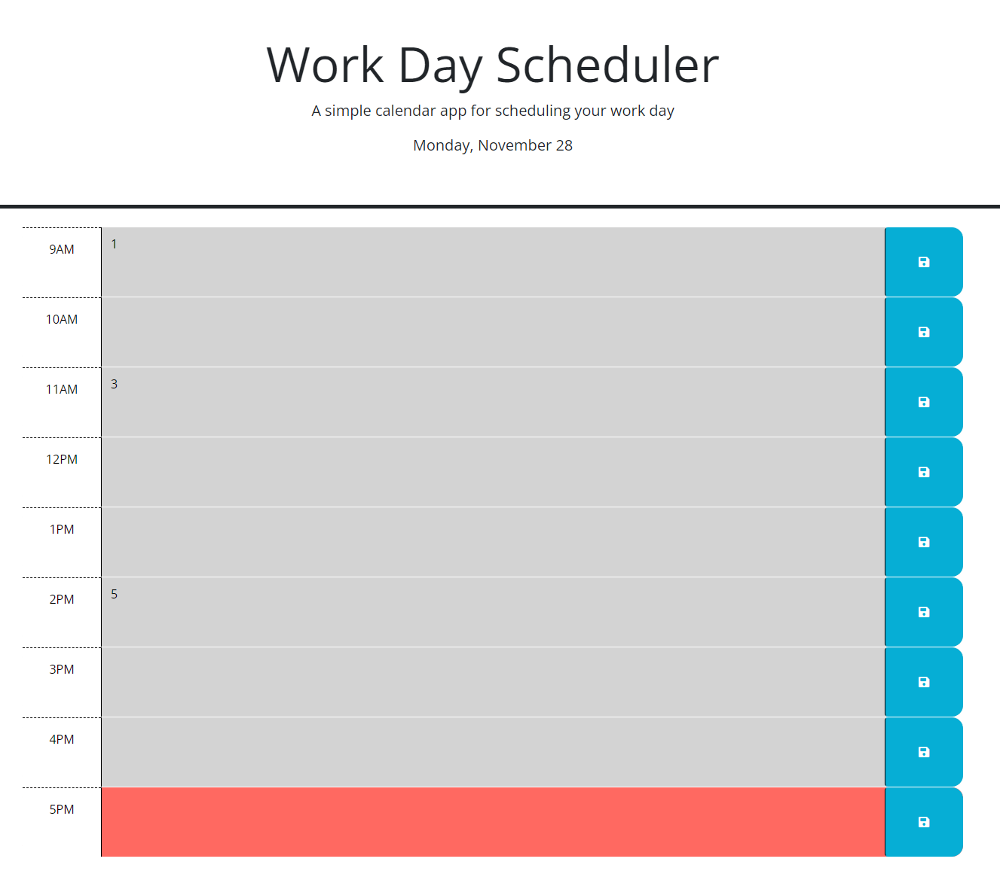

# Work Day Schedule Calendar

## Description
Have you ever wanted something to keep track of tasks throughout the work day? Then this is for you! It was made to help keep yourself organized and on track throughout the day. Just add whatever tasks you may have at a given time, hit save and you're all set! 

- What was your motivation?
- Why did you build this project? (Note: the answer is not "Because it was a homework assignment.")
- What problem does it solve?
- What did you learn?

## Usage
This webpage was designed to keep track of tasks that you may have throughout the work day. All you have to do is input your task for a set hour, and then click the save button on the right side of the page!

## Links
Live URL: https://jdanders99.github.io/Work-Day-Calendar/
GitHub Repo: https://github.com/Jdanders99/Work-Day-Calendar

## License
MIT License

Copyright (c) [2022] [Jakob Anderson]

Permission is hereby granted, free of charge, to any person obtaining a copy of this software and associated documentation files (the "Software"), to deal in the Software without restriction, including without limitation the rights to use, copy, modify, merge, publish, distribute, sublicense, and/or sell copies of the Software, and to permit persons to whom the Software is furnished to do so, subject to the following conditions:

The above copyright notice and this permission notice shall be included in all copies or substantial portions of the Software.

THE SOFTWARE IS PROVIDED "AS IS", WITHOUT WARRANTY OF ANY KIND, EXPRESS OR IMPLIED, INCLUDING BUT NOT LIMITED TO THE WARRANTIES OF MERCHANTABILITY, FITNESS FOR A PARTICULAR PURPOSE AND NONINFRINGEMENT. IN NO EVENT SHALL THE AUTHORS OR COPYRIGHT HOLDERS BE LIABLE FOR ANY CLAIM, DAMAGES OR OTHER LIABILITY, WHETHER IN AN ACTION OF CONTRACT, TORT OR OTHERWISE, ARISING FROM, OUT OF OR IN CONNECTION WITH THE SOFTWARE OR THE USE OR OTHER DEALINGS IN THE SOFTWARE.